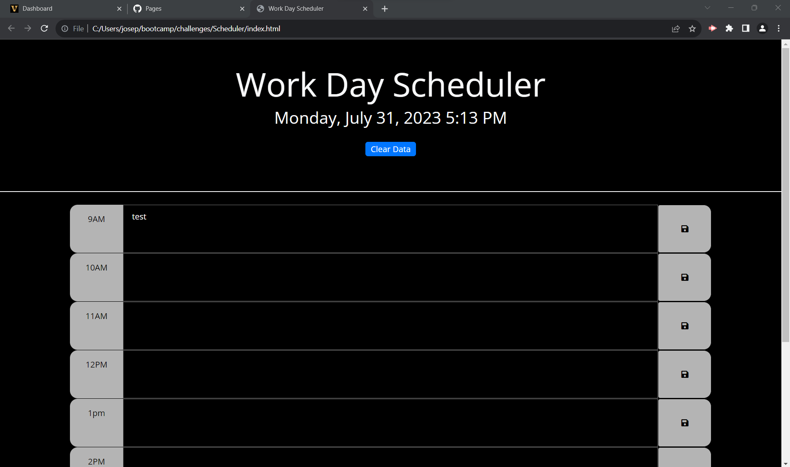

# Scheduler

## Description
- Used HTML to structure the header and timeblocks with save buttons
- Used CSS to style the page
- Used JavaScript and Jquery to accomplish the following:

    - When the page is loaded, the user is presented with the current date and time
    - When the page is viewed, the current hour's timeblock is highlighted in blue, and the past and future are blacked out
    - When the user enters text in a timeblock, they can select the save button to store the data locally
    - When the page is visited later or after closing, the saved data is recalled from local storage on page load
    - When the user selects the Clear Data button, the local storage cache is cleared and page reloads with empty timeblocks 

## Link to Site
https://joseph-s-foster.github.io/Scheduler/

## Screenshot
